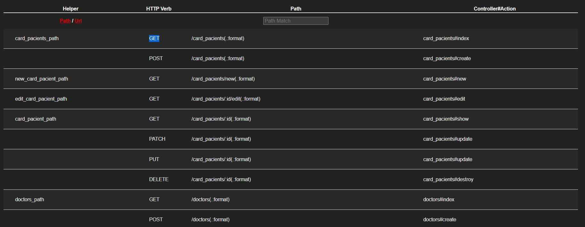
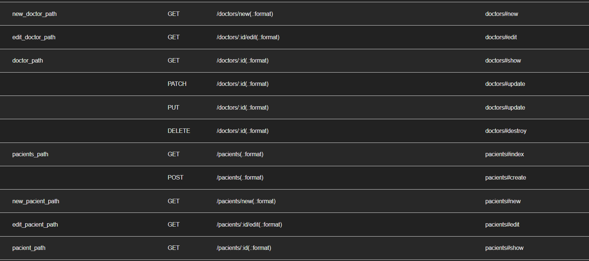
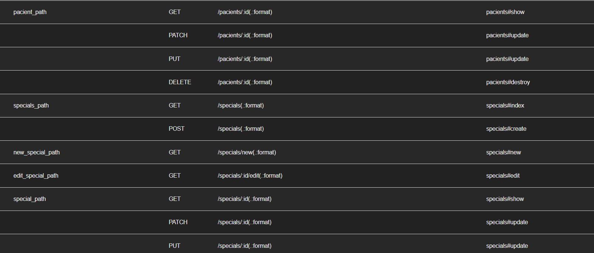
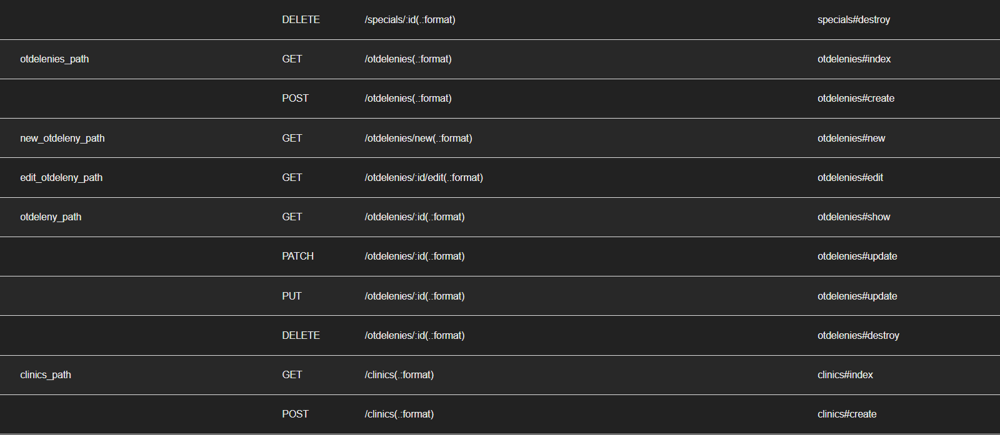
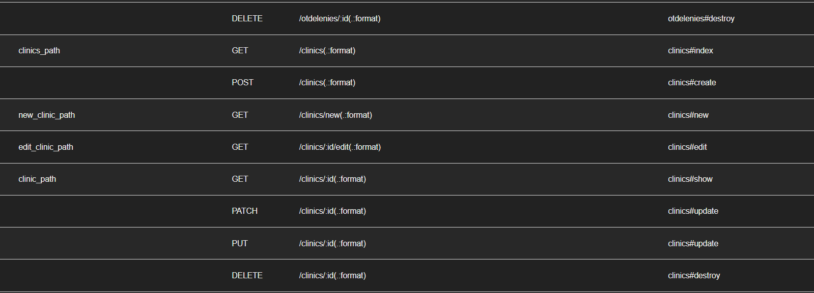
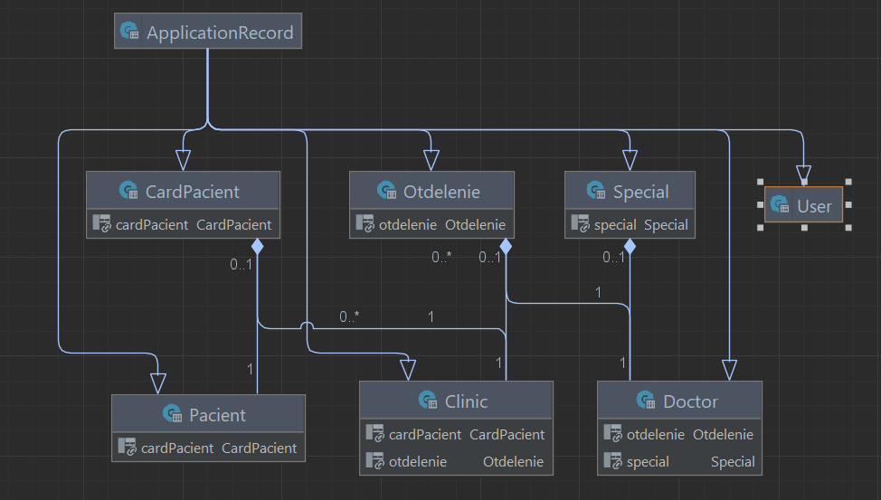

# README

# Hordiienko Mykyta Ks-31
Hospital app

## HTTP Verbs

## ERD diagram

### Labs
- [ ]  Task 1 -> Клиники (поля на выбор)
Отделение (поля на выбор. Клиника может иметь n отделений)
Врачи(поля на выбор. Отделение может иметь n врачей)
Специальность(поля на выбор. Врач может иметь 1 специальность)
карта пациента(поля на выбор В клинике может быть много карт)
Пациенты(поля на выбор В карте может быть 1 пациент)
- [ ] Task 2 --> Вставити 100 записів у ваші таблиці. У кожній групі по 6 таблиць в 3 таблиці зробити методи, які будуть обгорткою на чистому SQL. У 3 таблиці просто на ОРМ.
  У кожній моделі повинні бути методи на оновлення. В 3 таблиці зробити методи, які будуть обгорткою на чистому SQL. У 3 таблиці просто на ОРМ.
  Зробити по 2 SQL VIEW.
- [ ] Task 3 --> Зробити CRUD форми под кодну модель + README file
- [ ] Task 4 --> Додати гем Devise до вашого веб застосунку (повинна бути можливість зареєструватись/залогінитись/востановити пароль). Додати тести. Додати CSS/JS
- [] Task 5 --> 1.  зробити root_page (наповнення яке завгодно але повинне бути посилання на  вхід/реєстрацію)2. Пропрацювати інформацію про лікарні, бібліотеки (треба додати назву, рік створення)3.  створити таблиці як на зображені (кожна таблиця повинна мати пагінацію,  якщо ви бачите поля "number of ... " то так це кількість моделей в асоціації 🙂 не треба створвати поле треба його порахувати) (додати CSS)4. Створити сторінки під кожну модель5. Додати логіку під Пошук та Сортування ----- Створити це за допомогою QueryObject6. Додати тести під кожний елемент
- [] Task 6 --> зробити rake задачу котра буде парсити сайт, Та додавати у вашу БД назву лікарні або бібліотеки
